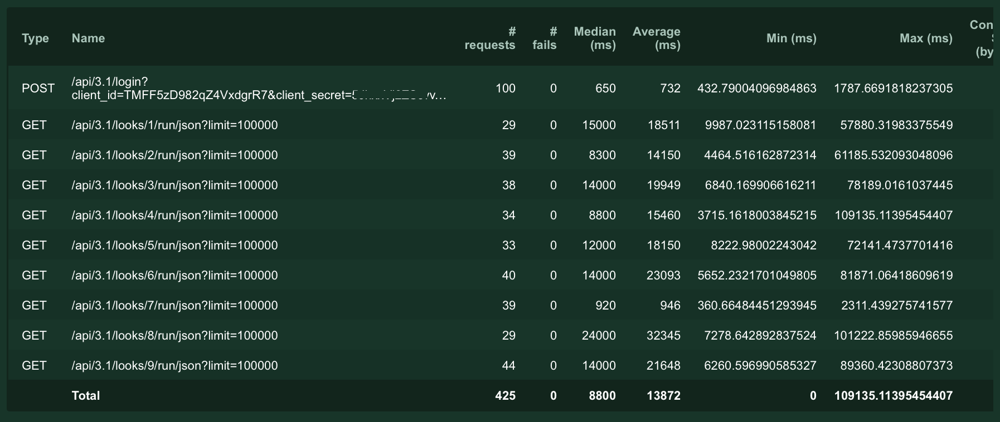
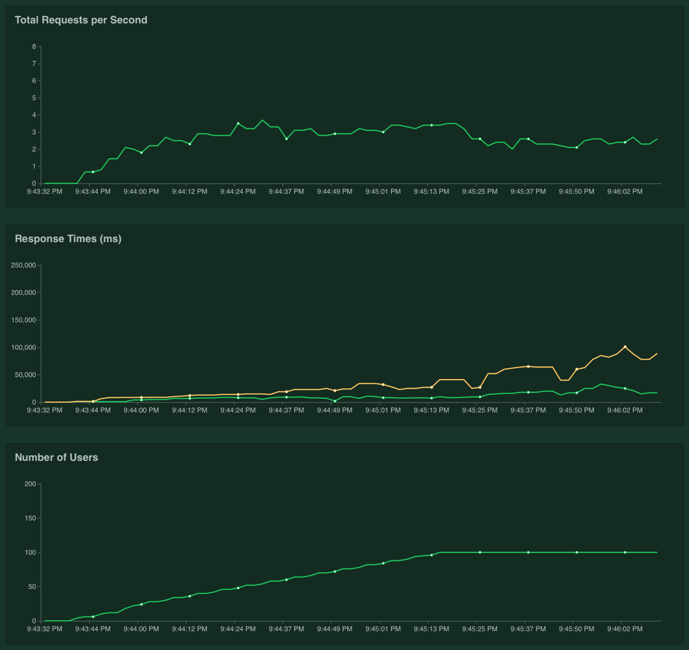

# Load Testing Looker's API with LocustIO
This locustfile can be used to generate many simultaneous requests that download look results from the Looker API.

## How to get started
- [Install LocustIO](https://docs.locust.io/en/stable/installation.html)
- Create a config.yml file with your API connection credentials
- From your working directory, start `locust --host=ucalgary` _(the host must match the name of a node in your config.yml file)_
    - You can also run locust [distributed](https://docs.locust.io/en/stable/running-locust-distributed.html) with multiple workers and really shake things out :muscle:
- Now, visit [http://127.0.0.1:8089](http://127.0.0.1:8089) to summon some locusts
    - You can simulate hundreds of simultaneous users
    - Each user will request results for random looks from your instance 
    - If you want to change the behaviour, modify [locustfile.py](locustfile.py)
    
### Request Statistics
The LocustIO web interface will show you request timing statistics for each look:

### Performance Charts
As well as correlated charts for requests per second, response time, and number of users:

